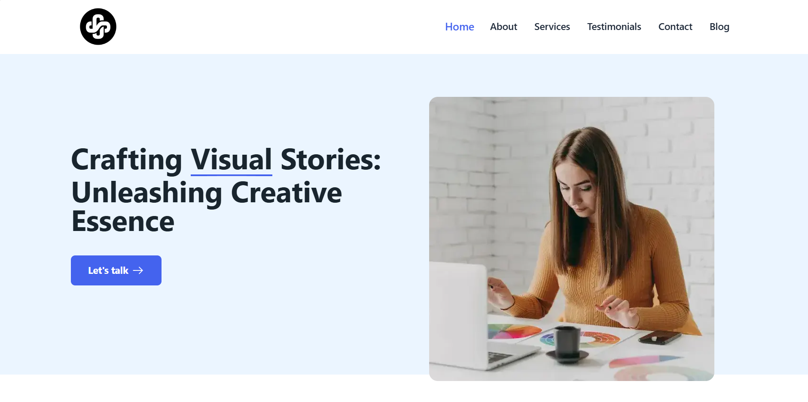
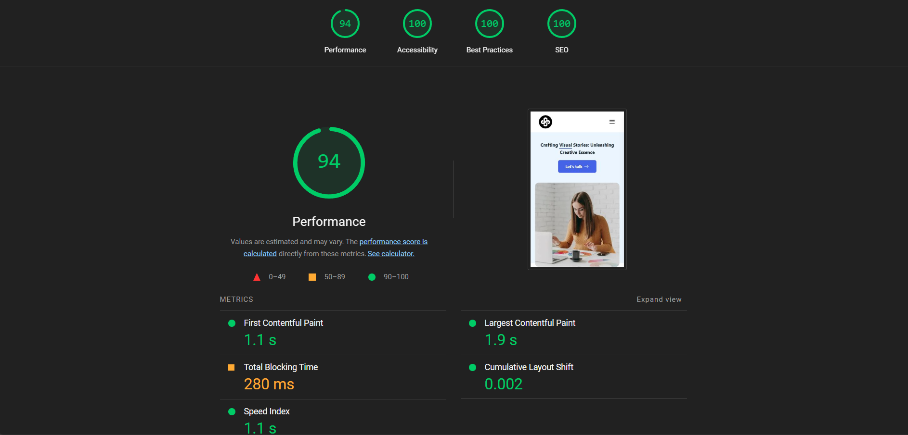

# Design Agency

A modern, responsive design agency website built with Next.js and Tailwind CSS. This project showcases a professional multi-page website with animations, interactive forms, and optimized performance.



## 📋 Table of Content

- [Demo](#🚀-demo)
- [Features](#✨-features)
- [Technologies Used](#🛠️-technologies-used)
- [Installation](#💻-installation)
- [Lighthouse Report](#📊-lighthouse-report)
- [Contributing](#🤝-contributing)
- [License](#📄-license)

## 🚀-Demo

Live demo: [Design Agency](https://design-agency-two.vercel.app/)

## ✨-Features

- **Modern Design** - Clean and professional UI for a design agency
- **Fully Responsive** - Optimized for all device sizes (mobile, tablet, desktop)
- **Performance Focused** - Fast loading and smooth animations
- **Newsletter Subscription** - Integrated subscription form
- **Contact Form** - Secure handling of form submissions
- **Animations** - Beautiful motion effects with Framer Motion
- **SEO Friendly** - Optimized metadata and semantic HTML
- **Server-Side API Routes** - Secure handling of form submissions

## 🛠️-Technologies Used

- **Framework**: [Next.js](https://nextjs.org/) with App Router
- **Styling**: [Tailwind CSS](https://tailwindcss.com/)
- **Animations**: [Framer Motion](https://www.framer.com/motion/)
- **Form Handling**: Custom API routes for secure submissions
- **TypeScript**: Type-safe code

## 💻-Installation

### Prerequisites

- Node.js 18.0 or later
- npm or yarn

### Setup

1. Clone the repository:

   ```bash
   git clone https://github.com/yamami-mohammed-monsif/Design-Agency.git
   cd Design-Agency
   ```

2. Install dependencies:

   ```bash
   npm install
   # or
   yarn install
   ```

3. Create a `.env.local` file based on `.env.example`:

   ```bash
   cp .env.example .env.local
   ```

4. Add your API keys to the `.env.local` file:
   ```
   NEXT_PUBLIC_API_KEY=your_api_key
   ```

### Development

Run the development server:

```bash
npm run dev
# or
yarn dev
```

Open [http://localhost:3000](http://localhost:3000) in your browser.

### Production Build

Build for production:

```bash
npm run build
# or
yarn build
```

Start the production server:

```bash
npm run start
# or
yarn start
```

## 📊-Lighthouse Report

This project has been optimized for performance, accessibility, SEO, and best practices. Below is a summary of the Lighthouse audit:



## 🤝-Contributing

Contributions are welcome! Please feel free to submit a Pull Request.

1. Fork the repository
2. Create your feature branch (`git checkout -b feature/amazing-feature`)
3. Commit your changes (`git commit -m 'Add some amazing feature'`)
4. Push to the branch (`git push origin feature/amazing-feature`)
5. Open a Pull Request

## 📄-License

This project is licensed under the MIT License - see the [LICENSE](/LICENSE.txt) file for details.
